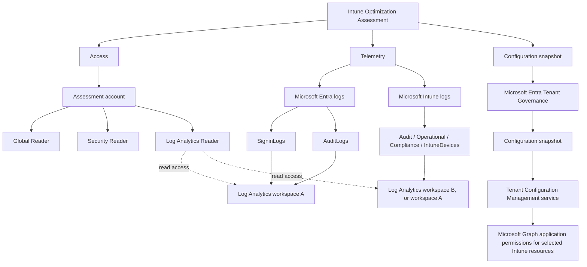

# Intune Optimization Assessment - Customer Preparation Guide

## Purpose

The Intune Optimization Assessment is designed as a predominantly read-only review of Microsoft Intune, Microsoft Entra ID, security configuration, operational telemetry, and the current Intune configuration.

Please complete and verify these prerequisites **before the assessment begins**.

The assessment uses three main sources of information:

1. Current Microsoft Intune and Microsoft Entra configuration.
2. Historical Microsoft Entra and Microsoft Intune telemetry in Azure Log Analytics.
3. Microsoft Entra Tenant Governance configuration snapshots for structured configuration analysis.

> **Important:** Microsoft Entra and Microsoft Intune logs can be stored in the same Log Analytics workspace or in different workspaces. Do not move or consolidate existing logging solely for this assessment. The assessment account needs read access to every workspace containing required telemetry.

---

## 1. Prepare the assessment account

Identify the user account that will be used to perform the assessment.

### 1.1 Assign Global Reader

In the **Microsoft Entra admin center**:

1. Go to **Identity > Roles & admins**.
2. Search for **Global Reader**.
3. Open the role.
4. Select **Add assignments**.
5. Select the assessment account.
6. Complete the assignment.

### 1.2 Assign Security Reader

Repeat the procedure above for **Security Reader**.

### Expected result

The assessment account has:

- **Global Reader**
- **Security Reader**

The account does not need Global Administrator for normal assessment activities.

---

## 2. Identify existing Log Analytics workspaces

The assessment uses historical telemetry from Microsoft Entra and Microsoft Intune.

In the Azure portal:

1. Open **Log Analytics workspaces**.
2. Identify the workspace receiving Microsoft Entra logs.
3. Identify the workspace receiving Microsoft Intune logs.
4. Record for each required workspace:
   - Subscription
   - Resource group
   - Workspace name
5. Determine whether the required data is already being collected.

Valid examples include:

```text
Workspace A
  - Entra SigninLogs
  - Entra AuditLogs

Workspace B
  - Intune diagnostic data
```

or:

```text
Workspace A
  - Entra logs
  - Intune logs
```

If suitable logging already exists, keep the existing architecture and proceed to access and verification.

---

## 3. Configure Microsoft Entra logging

> **Complete this before the engagement.** Historical Log Analytics data is only available for the period in which the relevant diagnostic collection has been active.

If Entra logging is already configured and the required data is available, do not create a duplicate diagnostic configuration.

### 3.1 Review or configure diagnostic settings

In the **Microsoft Entra admin center**:

1. Open **Entra ID**.
2. Go to **Monitoring & health > Diagnostic settings**.
3. Review existing diagnostic settings.
4. Determine whether the required logs are already sent to a Log Analytics workspace.
5. If not, select **Add diagnostic setting**.
6. Enter an appropriate name, for example `Intune-Optimization-Assessment`.
7. Enable at minimum:
   - `SigninLogs`
   - `AuditLogs`
8. Under **Destination details**, select **Send to Log Analytics workspace**.
9. Select the approved Azure subscription and workspace.
10. Save the setting.

Microsoft documentation: [Configure a Log Analytics workspace and a custom workbook](https://learn.microsoft.com/en-us/entra/identity/monitoring-health/tutorial-configure-log-analytics-workspace)

### 3.2 Verify Entra data

Open the workspace receiving Entra logs and go to **Logs**.

Run:

```kusto
SigninLogs
| take 10
```

Then:

```kusto
AuditLogs
| take 10
```

Both queries should return records.

The assessment uses sign-in telemetry to correlate device information, user identity, application/resource access, authentication results, and Conditional Access information.

---

## 4. Configure Microsoft Intune logging

> **Complete this before the engagement.** If suitable Intune diagnostic logging already exists, do not redirect it to another workspace solely for this assessment.

Microsoft Intune supports routing diagnostic data to Azure Monitor / Log Analytics.

### 4.1 Review the existing configuration

In the **Microsoft Intune admin center**:

1. Locate the Intune diagnostic settings.
2. Review existing destinations and enabled diagnostic categories.
3. Record the Log Analytics workspace receiving Intune data.
4. If the required data is already being collected, retain the existing configuration.

### 4.2 Configure Intune diagnostic settings if required

If the required data is not currently collected, configure Intune diagnostic settings to send the available categories corresponding to:

- **Audit Logs**
- **Operational Logs**
- **Device Compliance Organizational Logs**
- **IntuneDevices**

Select **Send to Log Analytics** and choose an approved workspace.

The Intune workspace can be different from the Entra workspace.

Microsoft documentation: [Send Intune log data to Azure Storage, Event Hubs, or Log Analytics](https://learn.microsoft.com/en-us/intune/governance/integrate-azure-monitor)

### 4.3 Verify Intune data

Open the Log Analytics workspace receiving Intune data and confirm that the configured Intune diagnostic data is present.

Do not consider preparation complete merely because a diagnostic setting exists. Verify actual records in the destination workspace.

---

## 5. Review historical data availability

Verify that the available telemetry covers a useful period for the assessment.

If logging has only just been enabled, earlier activity will not be present in that Log Analytics destination. Configure missing logging before the engagement so that data can accumulate in advance.

Existing customer requirements for retention, security, Azure governance, data residency, and cost remain applicable.

---

## 6. Grant Log Analytics access

The assessment account needs **Log Analytics Reader** on every workspace containing required assessment telemetry.

For each workspace:

1. Open the Log Analytics workspace in the Azure portal.
2. Open **Access control (IAM)**.
3. Select **Add > Add role assignment**.
4. Select **Log Analytics Reader**.
5. Assign the assessment account.
6. Scope the role to the workspace.
7. Complete the assignment.

Microsoft documentation: [Analyze Microsoft Entra activity logs with Log Analytics](https://learn.microsoft.com/en-us/entra/identity/monitoring-health/howto-analyze-activity-logs-log-analytics)

If Entra and Intune use separate workspaces, assign **Log Analytics Reader** on both.

---

## 7. Validate access using the assessment account

Perform these checks using the actual assessment account rather than the privileged account used for setup.

### Microsoft Entra

Verify that the account can inspect the areas needed by the assessment, including relevant:

- Devices
- Users and groups
- Enterprise applications
- Conditional Access configuration
- Authentication configuration
- Sign-in information
- Audit information

### Microsoft Intune

Verify that the account can open the Microsoft Intune admin center and inspect the configuration required for the assessment.

### Log Analytics

In the Entra logging workspace, run:

```kusto
SigninLogs
| take 10
```

and:

```kusto
AuditLogs
| take 10
```

Also open the workspace containing Intune telemetry and verify access to the available Intune data.

If organization-specific workspace, resource, table, or granular RBAC restrictions are configured, verify that they do not prevent the assessment account from reading the required tables.

---

## 8. Prepare Microsoft Entra Tenant Governance

The assessment uses **Microsoft Entra Tenant Governance configuration snapshots** to obtain a structured representation of the current Intune configuration.

Microsoft documentation: [Create configuration snapshots](https://learn.microsoft.com/en-us/entra/id-governance/tenant-governance/how-to-create-snapshots)

### 8.1 Verify licensing and availability

Verify that the tenant meets the applicable Microsoft Entra Tenant Governance licensing requirement.

Then confirm that the following area is available in the Microsoft Entra admin center:

**Tenant Governance > Snapshots**

### 8.2 Understand the two permission paths

The assessment account and Tenant Configuration Management service use different permissions:

```text
Assessment account
  - Global Reader
  - Security Reader
  - Log Analytics Reader on required workspace(s)

Tenant Configuration Management service
  - Microsoft Graph application permissions required for the
    Entra/Intune resource types selected in the snapshot
```

### 8.3 Configure Tenant Configuration Management service permissions

Use an appropriately privileged account, such as one with the authority to grant application permissions.

In the **Microsoft Entra admin center**:

1. Open **Tenant Governance**.
2. Select **Configuration management permissions**.
3. Open **Application permissions**.
4. Add the required app-only Microsoft Graph permissions for the Intune resource types that will be included in the snapshot.

Microsoft documentation: [Configure configuration management service permissions](https://learn.microsoft.com/en-us/entra/id-governance/tenant-governance/how-to-set-up-permissions-tenant-monitoring)

Supported Intune resource types are documented here: [Supported Microsoft Intune resources for Tenant Configuration Management](https://learn.microsoft.com/en-us/graph/utcm-intune-resources)

Do not rely on an old static list of permissions. Use the current Tenant Governance configuration-management permission experience and the permission validation presented for the selected snapshot resources.

---

## 9. Create and validate a test Intune configuration snapshot

Perform this test before the engagement.

In the **Microsoft Entra admin center**:

1. Go to **Tenant Governance > Snapshots**.
2. Select **New snapshot**.
3. Select the Microsoft Intune resource types required for the assessment.
4. Continue to **Settings**.
5. Enter a suitable snapshot name and optional description.
6. Continue to **Permissions**.
7. Review the permission status for the selected resources.
8. If required permissions are missing:
   1. Return to **Tenant Governance > Configuration management permissions**.
   2. Open **Application permissions**.
   3. Add the required permissions.
   4. Return to snapshot creation and validate again.
9. Create the test snapshot.
10. Verify that the snapshot completes successfully for the required Intune resources.
11. If the snapshot fails or is only partially successful, review and resolve the affected resource permissions before the engagement.

---

## 10. Microsoft Defender for Endpoint, if in scope

If the assessment includes deeper analysis of Microsoft Defender for Endpoint integration, verify Defender access separately.

Using the assessment account:

1. Open the Microsoft Defender portal.
2. Verify access to the security information required for the engagement.
3. If device-level analysis is required, verify access to device inventory.
4. If necessary, configure appropriate read permissions through the customer's Defender RBAC / Unified RBAC model.

Microsoft documentation: [Assign roles and permissions for Microsoft Defender for Endpoint](https://learn.microsoft.com/en-us/defender-endpoint/prepare-deployment)

---

# Final readiness checklist

## Assessment identity

- [ ] Assessment account identified
- [ ] Global Reader assigned
- [ ] Security Reader assigned
- [ ] Account can access Microsoft Entra admin center
- [ ] Account can access Microsoft Intune admin center

## Microsoft Entra telemetry

- [ ] Existing Entra diagnostic settings reviewed
- [ ] Workspace receiving Entra telemetry identified
- [ ] Missing logging configured before the engagement
- [ ] `SigninLogs` enabled
- [ ] `AuditLogs` enabled
- [ ] `SigninLogs | take 10` returns data
- [ ] `AuditLogs | take 10` returns data
- [ ] Historical data availability reviewed

## Microsoft Intune telemetry

- [ ] Existing Intune diagnostic settings reviewed
- [ ] Workspace receiving Intune telemetry identified
- [ ] Missing logging configured before the engagement
- [ ] Audit data selected
- [ ] Operational data selected
- [ ] Device Compliance data selected
- [ ] IntuneDevices selected
- [ ] Actual Intune data presence verified

## Log Analytics permissions

- [ ] All required workspaces identified
- [ ] Log Analytics Reader assigned on the Entra workspace
- [ ] Log Analytics Reader assigned on the Intune workspace if different
- [ ] Assessment account can query the required telemetry
- [ ] Customer-specific table/granular RBAC does not block required data

## Tenant Governance

- [ ] Tenant Governance licensing/availability verified
- [ ] Tenant Governance > Snapshots accessible
- [ ] Tenant Governance > Configuration management permissions accessible
- [ ] Required Tenant Configuration Management application permissions granted
- [ ] Snapshot Permissions validation passes for required resources
- [ ] Test Intune configuration snapshot created
- [ ] Snapshot successfully includes required Intune resources

## Defender for Endpoint, if in scope

- [ ] Required Defender read access verified
- [ ] Device inventory access verified if required
- [ ] Additional Defender RBAC configured if required

---

# Important pre-engagement requirement

> **Microsoft Entra and Microsoft Intune logging must be configured and verified before the Intune Optimization engagement starts if the corresponding telemetry is required for the assessment.**
>
> Existing logs do not need to be moved. Entra and Intune telemetry may reside in the same Log Analytics workspace or different workspaces.
>
> If the required logging is not currently configured, configure it in advance. Enabling diagnostic collection at the start of the engagement does not provide historical Log Analytics records from before collection was enabled.
>
> The assessment account must have **Log Analytics Reader** on every workspace containing telemetry required for the assessment.
>
> Verify actual data in the workspace, not only the existence of diagnostic settings.

---

## Assessment architecture



The Entra and Intune telemetry workspaces may be the same workspace or different workspaces. Existing logging does not need to be consolidated solely for the assessment.

---

# Optional setup script

The following script automates the read-only role assignments for the assessment account. It intentionally **does not change diagnostic settings or Tenant Governance application permissions**. Those items should be reviewed/configured explicitly using the procedures above because they affect tenant configuration, data collection, and potentially Azure consumption.

Save the following as `Prepare-IntuneOptimizationAssessment.ps1` or download the companion script from this repository.

```powershell
# Companion script: Prepare-IntuneOptimizationAssessment.ps1
# See the standalone script file in this repository for the executable version.
```

## What the script does

- Prompts for the assessment account UPN.
- Assigns Microsoft Entra **Global Reader**.
- Assigns Microsoft Entra **Security Reader**.
- Lists accessible Azure subscriptions and allows the administrator to select one or more Log Analytics workspaces.
- Assigns **Log Analytics Reader** on each selected workspace.
- Prints the remaining manual readiness checks for Entra logging, Intune logging, Tenant Governance, and optional Defender access.

## What the script does not do

- Create the assessment user.
- Enable or modify Microsoft Entra diagnostic settings.
- Enable or modify Microsoft Intune diagnostic settings.
- Alter retention settings.
- Grant Tenant Configuration Management application permissions.
- Create a Tenant Governance snapshot.
- Modify Intune policies, applications, devices, Conditional Access, or security settings.
